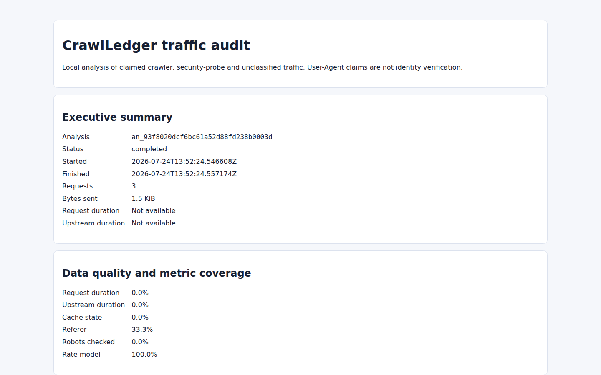

# CrawlLedger

**See what crawlers cost your origin before you decide what to block.**

[![CI][badge-ci]][ci]
[![Go][badge-go]][go-module]
[![Builds][badge-builds]][ci]
[![Checks][badge-checks]][ci]
[![Offline runtime][badge-offline]][ci]
[![Security policy][badge-security]][security]
[![License: MIT][badge-license]][license]

Access logs show footprints. They rarely show the bill.

CrawlLedger reads the Nginx or Caddy logs you already have and turns them into
something you can reason about: which claimed crawlers arrived, where they
wandered, how much origin work followed, whether they fell into a crawl trap,
and what a deny or rate-limit policy would have changed.

Everything stays local. The result is a self-contained HTML report, a
machine-readable JSON report and—only after a separate simulation—reviewable
server-configuration fragments. No telemetry. No daemon. Nothing in the
request path, and no command that quietly rewrites a live server.

CI checks formatting, runs `go vet`, and tests on Go 1.26.5 across Ubuntu,
macOS and Windows. It also runs the race detector, eight fuzz smoke targets,
validates generated Nginx and Caddy fragments, exercises analysis without a
network namespace, cross-builds six pure-Go binaries, and checks schemas, docs
and module integrity.



<sub>This is the actual HTML report from the synthetic fixture included in the repository. No production traffic is shown.</sub>

## What you get

- Claimed search, AI/LLM, monitoring and other crawler traffic, broken down
  without pretending a User-Agent is proof of identity.
- Origin load by normalized route: response bytes, duration, upstream time and
  cache state whenever the source log actually contains those fields.
- Deterministic findings for crawl traps, expensive 404s, query-space
  explosion, cache busting, security probes and `robots.txt` violations.
- Historical policy simulation with ordered, first-match rules.
- Nginx or Caddy configuration drafts. Drafts—not auto-applied changes.
- Privacy-conscious storage; raw log lines are never written to the workspace.

There is one hard boundary. A request labelled `Googlebot`, `GPTBot`, or
anything else has merely claimed that name through its `User-Agent` header.
CrawlLedger does not DNS-verify it. The label may be spoofed.

## Quick start

One prerequisite: Go 1.26.5.

```sh
make build

./bin/crawlledger analyze \
  --input testdata/logs/nginx-combined/valid.log \
  --format nginx-combined \
  --output ./demo-audit
```

Open `demo-audit/report.html` in a browser. The fixture is tiny—three synthetic
requests—but it still demonstrates crawler classification, route
normalization, missing-metric disclosure and a security-probe finding.

Output paths must be new. Deliberately. CrawlLedger refuses to replace an
existing workspace, simulation, evidence bundle, or rendered configuration.

There is no public v1 tag yet, so build from this checkout for now. Tagged
releases will carry binaries and checksums on
[GitHub Releases](https://github.com/balyakin/crawlledger/releases).

## Analyze your logs

Nginx combined log? Point CrawlLedger at it:

```sh
crawlledger analyze \
  --input /var/log/nginx/access.log \
  --format nginx-combined \
  --output ./crawl-audit
```

Caddy JSON is just as direct:

```sh
crawlledger analyze \
  --input /var/log/caddy/access.log \
  --format caddy-json \
  --output ./crawl-audit
```

Repeat `--input` to process several files in order. Plain text and gzip are
detected from their contents, not from a hopeful filename suffix. Use
`--input -` once to read standard input.

One run, one explicit format. CrawlLedger does not guess; a firm parse error
is safer than a polished report built from the wrong grammar.

### Input formats

| Format | Use it for | Metric coverage |
| --- | --- | --- |
| `nginx-combined` | The standard Nginx combined format | Requests, status, bytes, referer and User-Agent |
| `nginx-json` | The CrawlLedger Nginx JSON format below | Adds request time, upstream time and cache state |
| `caddy-json` | Standard Caddy JSON access logs | Adds request duration; upstream and cache metrics are unavailable |
| `crawlledger-json` | A bundle created by `crawlledger sanitize` | Preserves the metrics present in the source bundle |

<details>
<summary>Recommended Nginx JSON log format</summary>

Add this inside the Nginx `http` block:

```nginx
log_format crawlledger escape=json
  '{"timestamp":"$time_iso8601",'
  '"remote_addr":"$remote_addr",'
  '"method":"$request_method",'
  '"uri":"$request_uri",'
  '"status":"$status",'
  '"bytes_sent":"$body_bytes_sent",'
  '"request_time":"$request_time",'
  '"upstream_response_time":"$upstream_response_time",'
  '"upstream_cache_status":"$upstream_cache_status",'
  '"user_agent":"$http_user_agent",'
  '"referer":"$http_referer"}';

access_log /var/log/nginx/access.crawlledger.json crawlledger;
```

Then analyze it:

```sh
crawlledger analyze \
  --input /var/log/nginx/access.crawlledger.json \
  --format nginx-json \
  --output ./crawl-audit
```

</details>

### Inside the workspace

| File | Purpose |
| --- | --- |
| `report.html` | Local, self-contained report for a browser or print-to-PDF |
| `report.json` | Versioned report for scripts and further analysis |
| `analysis.sqlite` | Normalized aggregates and bounded parse diagnostics |
| `manifest.json` | Completion marker, artifact sizes and SHA-256 hashes |

No `manifest.json`? Treat the workspace as incomplete.

## Test a policy before writing configuration

Analysis tells you what happened. Simulation asks the more dangerous question:
what would a policy have done?

Policies are strict, versioned JSON. Rules run from top to bottom; the first
match wins. Small examples live in
[`testdata/policies`](testdata/policies).

```sh
crawlledger policy simulate \
  --workspace ./crawl-audit \
  --policy ./testdata/policies/safe.json \
  --output ./simulation.json
```

Read the totals. Then the rule impacts, coverage and assumptions. Most of all,
read every item in `risks`.

Some risks demand an explicit acknowledgement before rendering:

```sh
crawlledger policy render \
  --workspace ./crawl-audit \
  --policy ./testdata/policies/safe.json \
  --simulation ./simulation.json \
  --target nginx \
  --output ./rendered-nginx \
  --ack claimed-allow-bypass:allow-googlebot
```

That acknowledgement belongs to the bundled example. Use the exact IDs from
your own `simulation.json`; unknown IDs and non-acknowledgeable blockers are
rejected.

Nginx drafts support `allow`, `deny` and fixed rate profiles. Caddy drafts
support `allow` and `deny`. Cache rules are analytical upper bounds, so a
policy containing one remains simulation-only and cannot be rendered.

### Install a draft carefully

Draft means draft. CrawlLedger never runs Nginx, Caddy, Docker, systemd, SSH,
or a shell.

For Nginx, include `crawlledger-http.conf` inside `http {}` and
`crawlledger-server.conf` inside the audited `server {}`, before the content
handler. Back up the current configuration. Then validate:

```sh
nginx -t
```

For Caddy, import `Caddyfile.crawlledger` before `reverse_proxy`, then run:

```sh
caddy adapt --config Caddyfile --adapter caddyfile --validate
caddy validate --config Caddyfile
```

Reload manually and watch responses as well as access logs. If validation or
traffic turns strange, restore the backup and reload.

## Share a sanitized evidence bundle

A raw access log is useful evidence wrapped around sensitive data. Do not pass
it around casually. Create a pseudonymized bundle instead:

```sh
crawlledger sanitize \
  --input /var/log/nginx/access.log \
  --format nginx-combined \
  --output ./crawl-evidence \
  --key-file /secure/crawlledger.key
```

If the key file does not exist, CrawlLedger creates a private-permission,
32-byte key. Keep it outside both bundle and workspace. Reusing the key makes
pseudonyms comparable across runs; omitting `--key-file` creates an ephemeral
key that is not retained.

Before any record reaches disk, CrawlLedger:

- replaces client IPs and User-Agent values with domain-separated HMAC
  pseudonyms;
- removes query values while keeping safe query-key names;
- normalizes token-like path segments;
- cuts referers down to hostnames;
- discards cookies and raw log lines.

Safer is not anonymous. The bundle still holds timestamps, normalized routes,
crawler claims, referer hosts and stable pseudonyms; those can be correlated
or re-identified. Treat bundles, workspaces, simulations, keys and generated
configuration as sensitive files.

## Honest limits

- Claimed crawler identity is spoofable. CrawlLedger audits traffic; it does
  not authenticate bots.
- Analysis is batch-based. There is no live protection.
- Combined Nginx and standard Caddy logs cannot expose every origin or cache
  metric. Reports show the holes instead of filling them with guesses.
- Cost figures are proportional allocations driven by your configuration,
  neither invoices nor promised savings.
- Cache simulation cannot see application semantics such as `Authorization`,
  `Set-Cookie`, `Cache-Control`, or `Vary`.
- History is not prophecy: a simulation cannot know how a crawler will react
  after the policy changes.

## License

CrawlLedger is released under the [MIT License](LICENSE). Third-party
attributions live in [NOTICE](NOTICE).

## Development

The everyday local gate is short:

```sh
make check
```

That checks formatting, runs `go vet`, tests the code and builds the project.
Before a release—or after changing parsing, normalization, policy evaluation,
or rendering—go further:

```sh
make test-race
make fuzz-smoke
```

Fixtures use synthetic documentation addresses and `.example` domains. Keep
production logs, customer workspaces, credentials and real HMAC keys out of
the repository.

Read [CONTRIBUTING.md](CONTRIBUTING.md) before touching schemas, migrations, or
the embedded crawler catalog. Security reports take a different route: follow
[SECURITY.md](SECURITY.md), and never place sensitive details in a public
issue.

This project was developed with AI assistance and is maintained by the author.

[badge-ci]: https://github.com/balyakin/crawlledger/actions/workflows/ci.yml/badge.svg
[badge-go]: https://img.shields.io/badge/go-1.26.5-00ADD8?logo=go&logoColor=white
[badge-builds]: https://img.shields.io/badge/build-linux%20%7C%20macOS%20%7C%20Windows-brightgreen
[badge-checks]: https://img.shields.io/badge/checks-vet%20%7C%20race%20%7C%20fuzz-brightgreen
[badge-offline]: https://img.shields.io/badge/runtime-offline-blueviolet
[badge-security]: https://img.shields.io/badge/security-policy-blue
[badge-license]: https://img.shields.io/badge/license-MIT-green.svg
[ci]: https://github.com/balyakin/crawlledger/actions/workflows/ci.yml
[go-module]: go.mod
[security]: SECURITY.md
[license]: LICENSE
